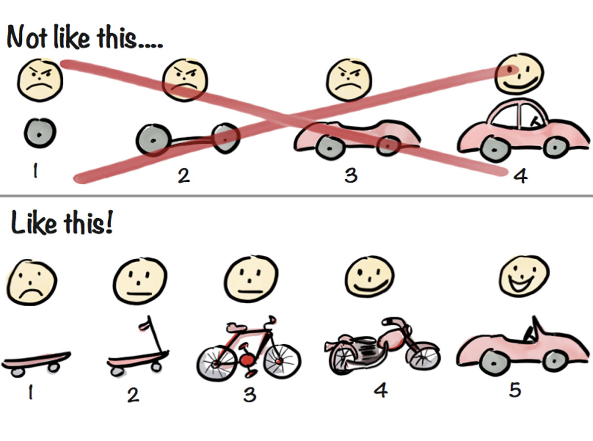

# Agile 101

## Learning objectives

* the goal of agile
* the objectives of agile
* agile principles
* ceremonies
  * inceptions
  * release planning
  * daily stand-up
  * kick off
  * desk checks
  * showcase
  * retros
* techniques
  * pair programming
  * TDD
  * iterations
  * user stories
  * story board
  * cross functional teams

    \(Note: this is not an exhaustive list!\)

## What is agile?

A way of collaboratively building services, products, and software that is all about planning for, and assuming **change**

## The [agile manifesto](http://agilemanifesto.org/)

We are uncovering better ways of developing software by doing it and helping others do it. Through this work we have come to value:

* **Individuals and interactions** over processes and tools
* **Working software** over comprehensive documentation
* **Customer collaboration** over contract negotiation
* **Responding to change** over following a plan

Essentially, the goal of agile practices is to allow teams to:

* make feedback loops shorter
* make people awesome
* deliver value continuously
* experiment and learn rapidly
* make safety a prerequisite

## Agile principles

* Our highest priority is to satisfy the customer through **early and continuous delivery of valuable software**.
* **Welcome changing requirements**, even late in development. Agile processes harness change for the customer's competitive advantage.
* **Deliver working software frequently**, from a couple of weeks to a couple of months, with a preference to the shorter timescale.
* **Business people and developers must work together daily** throughout the project.
* Build projects around **motivated individuals**. Give them the environment and support they need, and trust them to get the job done.
* The most efficient and effective method of conveying information to and within a development team is **face-to-face** conversation.
* **Working software** is the primary measure of progress.
* Agile processes promote **sustainable development**. The sponsors, developers, and users should be able to maintain a constant pace indefinitely.
* Continuous attention to **technical excellence and good design** enhances agility.
* **Simplicity**--the art of maximizing the amount of work not done--is essential.
* The best architectures, requirements, and designs emerge from **self-organizing teams**.
* At regular intervals, the team **reflects on how to become more effective**, then tunes and adjusts its behavior accordingly.

## Iterative software delivery

## Lab:

**Origami time!**

## Resources

* [Software Design in the 21st Century](https://www.youtube.com/watch?v=1sDBVid419M)
* [Modern Agile](https://www.youtube.com/watch?v=ChTDwUK3Fw0)
* [https://jessefewell.com/agile-vs-agile/](https://jessefewell.com/agile-vs-agile/)
* [Retrospectives Wiki](http://retrospectivewiki.org/index.php?title=Retrospective_Plans)

## Topics to cover

* Agile team roles in context
  * Experience design / user testing
  * QA in context & types of testing, testing pyramid
  * BA 
* User stories - INVEST, Acceptance criteria, vertical slices, proper sizing, patterns and antipatterns
* Cross functional requirements
  * Security in our DNA
* Inception Process
* Feedback
* Retrospectives
* Effective communication
* Vertical slicing of application layers
* Continuous integration
* Continuous delivery \(or how to release software\)

