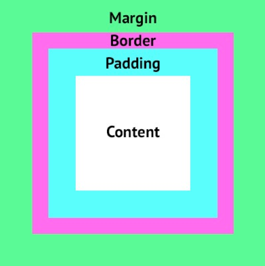

# Box Model

The box model defines how wide and tall a HTML element will be. For example, to determine the **horizontal** space an element occupies, you add up the content + padding-left + padding-right + border-left + border-right + margin-left + margin-right:



```css
/* index.html */
<div> Hello world </div>

/* style.css */
div {
  /* content */
  width: 500px;
  height: 500px;
  background: tomato;

  /* padding */
  padding: 100px;

  /* margin */
  margin: 100px;

  /* border */
  border: 10px solid black;
}
```

## Other possible values for `padding` and `margin`

CSS offers multiple ways for specifying values for `padding` and `margin` \(referred below as `X`\)

* `X-top/right/bottom/left` suffixes \(e.g. `margin-left: 50px`\)  \(this applies to `border` too, e.g. `border-left`\)
* `X: topbottom leftright` \(e.g. `margin: 10px 100px`\)
* `X: North East South West` \(e.g. `margin: 10px 50px 100px 200px`\)

  Example:

```css
/* index.html */
<div class='main'>
  <div class='child'>hello css</div>
</div>

/* style.css */
.main {
  width: 500px;
  height: 500px;
  background: tomato;
  padding: 10px 100px; 
  /* padding: 10px 50px 100px 200px;  */  /* uncomment this and try it out */
}

.child {
  background: orange;
  width: 100%;
  height: 100%;
}
```

## Box-sizing

`box-sizing` is a css property that can take 2 possible values: `box-sizing: content-box` \(this is the default but unintuitive option\) or `box-sizing: border-box` \(the more intuitive option\). The `box-sizing` CSS property defines how the browser should calculate the total width and height of an element.

* `content-box`: By default in the CSS box model, the width and height you assign to an element is applied **only** to the element's **content** box. If the element has any border or padding, this is then **added** to the width and height to arrive at the size of the box that's rendered on the screen.
  * This means that when you set width and height you have to adjust the value you give to allow for any border or padding that may be added. This is really **unintuitive**, and that's why we can use the `box-sizing: border-box` css property. 
* `border-box`: This tells the browser to account for any **border** and **padding** in the values you specify for width and height. **If you set an element's width to 100 pixels, that 100 pixels will include any border or padding you added, and the content box will shrink to absorb that extra width. This typically makes it much easier to size elements.**

Try it out [here](https://codepen.io/davified/pen/bKprGY?editors=1100)!

```css
/* index.html */
<div class='main'>
  <div class='hello'>hello</div>
</div>

/* style.css */
.main {
  width: 500px;
  height: 500px;
  background: tomato;
  box-sizing: border-box;

  /* add padding: 100px             and observe that the height stays as 500px*/
  /* add border: 100px solid black  and observe that the height stays as 500px*/
  /* repeat these 2 steps with box-sizing: border-box turned off */
}

.hello {
  background: orange;
  width: 100%;
  height: 100%;
}
```

