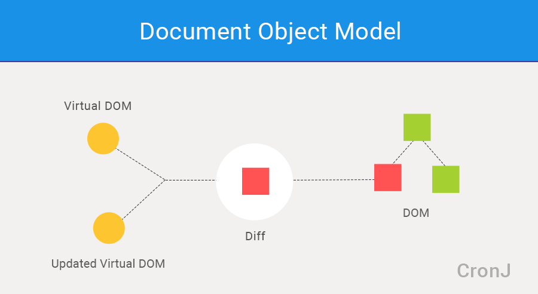

# Virtual DOM

Internally, React has a virtual DOM and a 'diff-ing' mechanism to calculate what has changed, and React only updates what’s necessary! (See example [here](https://codepen.io/gaearon/pen/zKRGpo?editors=0010) - inspect Elements and observe that only the h2 tag in the DOM is changing)

## Recommended reading
- https://medium.com/@hidace/understanding-reacts-virtual-dom-vs-the-real-dom-68ae29039951
- [Long but comprehensive explanation of React's virtual DOM mechanism](https://evilmartians.com/chronicles/optimizing-react-virtual-dom-explained)

## Further reading:
- [Virtual DOM in ReactJS](https://hackernoon.com/virtual-dom-in-reactjs-43a3fdb1d130)
- [React Reconciliation Process](https://reactjs.org/docs/reconciliation.html)
- [ReactJS Documentation](https://reactjs.org/docs/faq-internals.html)
- [Virtual DOM Explained](https://evilmartians.com/chronicles/optimizing-react-virtual-dom-explained)