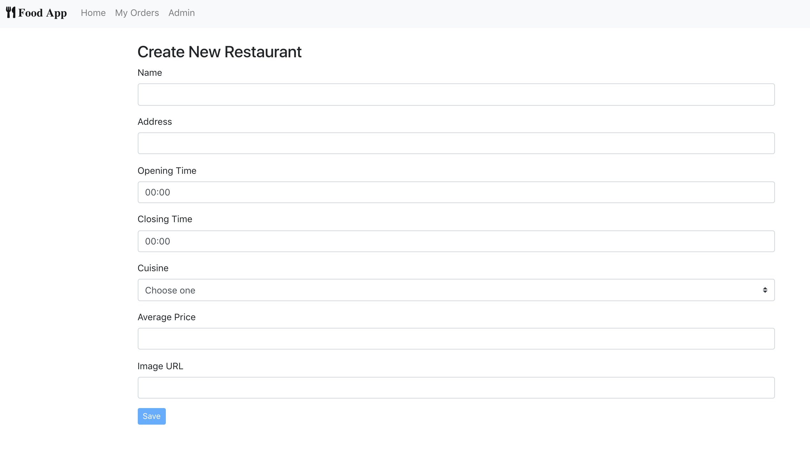
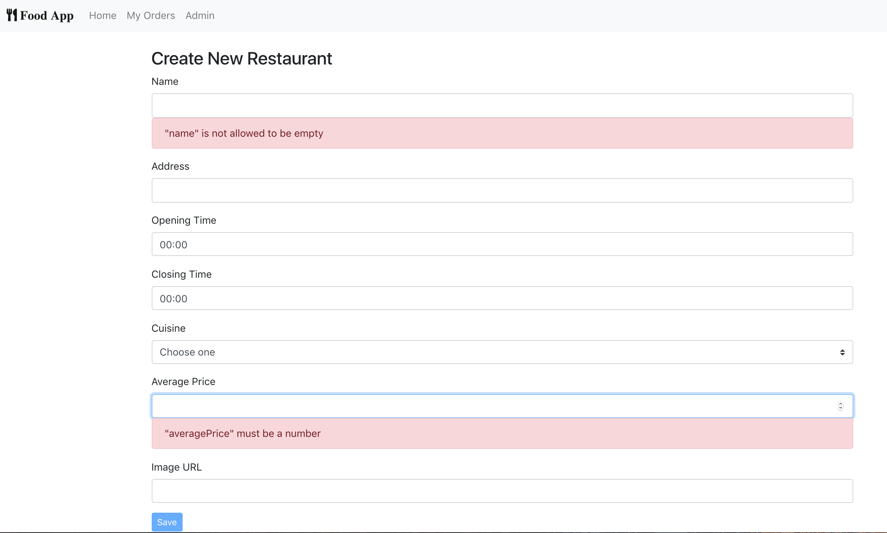

# Lab 8: Add validation for New Restaurant form

In real life, we cannot expect users to input valid data our application. They could attempt to input invalid data due to:

- a new user being unfamiliar with the application
- a new user did a typo and tried to save
- a malicious user is entering invalid data on purpose

If invalid data is saved, we could corrupt the database with rubbish data and / or cause a crash in the application at a later stage.

We can avoid the first two scenarios if we add form validation to:

- prevent a user from saving invalid data
- and provide an informative and helpful error message so that they can correct their input and save it

For the last scenario we will have to secure the route so that only an authenticated user with the role of Admin can access the new restaurant form.

We will implement this role based permission only at a later point in the course when we have a complete app with backend and user login feature

In this lab you are required to add front-end validation to the new restaurant form with a 3rd party library

Joi is a library that lets you define a schema of attributes, its expected values (eg: number or string), and if it is compulsory or not.

This library has two variants. `joi-browser` is capable of providing front-end validation in the browser and `joi` is for providing backend validation in nodejs.

We will be using `joi-browser` in this lab as React is a frontend framework and its code runs in the browser.

## Feature details

- Navigate to the menu-app project directory on your computer
- checkout to the lab 8 branch

```
  git checkout lab8
  git branch
```

### Step 1: Install Joi-browser

```
  npm install joi-browser
```

### Step 2: Create the Schema

Visit the Joi [README documentation](https://github.com/hapijs/joi) and read up on the syntax

Create the Joi schema for the below restaurant attributes

- name: string, and is compusory
- address: string, and is compusory
- openingTime: string, and is compusory
- closingTime: string, and is compusory
- cuisineId: string, and is compusory
- averagePrice: integer number, minimum value 1, and is compusory
- imageUrl: string, is a url, and is compusory

### Step 3: Validate input upon form submission

- Create a validate method to validate form inputs with the `Joi.validate()` and the schema
- Use the validate method in the form submission handler
- do a console log of the validation results to ensure that it is correctly detecting invalid inputs
- abort the form submission if any input is invalid

### Step 4: Disable the Save button if any input is invalid

- set the disabled attribute on the Save button with the result from the validate method
- test on the UI that the:
  - Save button is disabled upon page load
  - Save button is enabled when all compulsory fields have a valid input
  - Save button is disabled again when any one of the input has an invalid input

### Step 5: Display the error message below the text form field as a user types

- Modify `Input` component to take an error and display it as an alert message
- In `RestaurantForm`
  - create a `validateField()` method to validate an individual form field
  - use the `validateField()` method in the `handleChange()` event handler to validate the input value of a field
  - save the error message to the state
  - in `render()` get the error message from the state and pass it to the text and number input fields

## Expected Output

This screenshot is a sample of the expected output





## Hints

- if you have trouble displaying the value in the select field try replacing `defaultValue=""` with `value={value}`
- The style for the alert message can be found at [bootstrap alerts](https://getbootstrap.com/docs/4.1/components/alerts/)

## Solution
- After you have completed Lab 8, please commit all your work to the `lab8` branch

- You may optionally install the plugin **Git History Diff** for viewing the difference between git branches. This will allow you to easily compare your work with the sample solution 

- [https://marketplace.visualstudio.com/items?itemName=huizhou.githd](https://marketplace.visualstudio.com/items?itemName=huizhou.githd)

- Next checkout to the solution branch and we will now walk through the sample solution
```text
git checkout master
``` 

- To view the difference between your work and the sample solution go to the VS Code file explorer, right click your folder and select `GitHD: View Folder Diff` and select compare with `lab8` branch 

- The diff sidebar will popup and you can click on the files to view the difference between your work and the sample solution.

- When viewing the diff you can temporarily toggle the sidebar with `cmd + B` to hide it.

## Testing
- Next we will discuss how to test the feature with react-testing-library