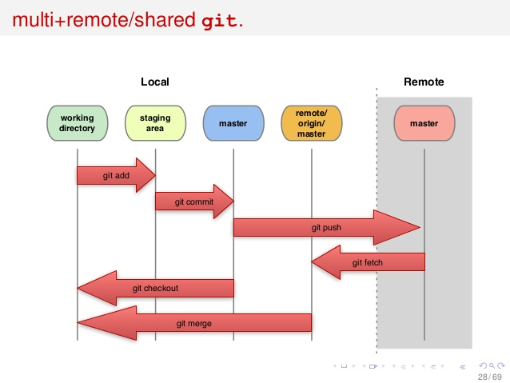

# Getting Started with Git

## Configure Git

Verify that your name and email are set:

* `git config user.name`
* `git config user.email`

## Code-along to understand basics of Git
* Create a base directory on your local machine with the following:
* Create directory `mkdir` called `myapp`
  * `touch` two files in the directory
    * `app.js`
    * `index.html`
* `git init` - Initialize folder as a git repository
* `git add <file>` - Add selected files to staging area
  * `git add .` - Add all files to staging area
  * `git reset <filename or path>` - Unstaging selected file
* `git status` - Check status of the working directory and staging area
* `git commit` - Make a commit to git
  * `git commit -m` - Make a commit with a message flag to git
* `git log` - Check previous commits made in the repository
* `git remote add origin https://github.com/user/repo.git` - This is to link the local repo to the remote repo with the name origin and the given repository URL.
* `git push -u origin master` - This is to push the local repo code to the origin master branch
* `git clone` - Clone remote repo to your local machine
* `git pull` - Pull latest changes down to your local machine

## Working Directory, Staging Area, Local Repository and Remote Repository



The working directory is a single checkout of one version of the project. These files are pulled out of the compressed git database and placed on disk for you to use or modify. Git keeps tracks of modifications or new files in the working directory. These changes can be viewed with the command `git status` 

After a file is added with `git add` it is transferred to the staging area. The staging area provides a place to stage changes before it is commited to the local repository. The two uses for the staging area is to prepare commits, and it is also used internally by git during merge conflicts. (merge conflicts will be discussed later)

When changes are ready to be committed the `git commit` command will bundle all the changes in the staging area and save it as a commit in the local repository

To share changes with others, you can synchronise from commits from the local repository to the corresponding remote repository with the command `git push`

## Life cycle of file status


## Exercise: Git Basics

[https://github.com/thoughtworks-jumpstart/git-basics](https://github.com/thoughtworks-jumpstart/git-basics)

## Using Git

### Cloning an existing git repo to our local machine

```text
git clone <repo-url>
```

### Committing changes to the local repository

* `git status` - See status of changes and commits
* `git add <path/to/file>` - Add a file to staging
  * `git reset <path/to/file>` - Remove file from staging
* `git commit` - Commit the file to git

### Writing a proper commit message

- As commit messages will accompany your commits in the git history, in a real project you should key in a message that informs the reader why you did that commit.

- A commit message can contain a title line and a body

**Title-line**
- The title-line starts with a capital letter, is 50 characters (or less), and has no punctuation at the end.

- It should be in the imperative voice. i.e. ‘Add test for login page’ instead of  ‘Added test for login page’ 


**Body**
- Add a blank line and key in the details in the body if there are any
- If using vim :wq  to save and quit  (or just close the VS code commit message window)


### Ignoring files with `.gitignore`

* why do we need .gitignore
  * how to ignore files and directories
* how to ignore wildcards
  * comments in .gitignore must start with \# and must start at beginning of the line

### Pushing local commits to the remote repository

```text
git push origin master
```

### Fetching new changes from the remote repository

```text
git pull
```

### Checking the log

```text
git log
```

### Creating a git repo locally and publishing it to GitHub

* `git init` - Initialize folder as a git repository
* `git remote add origin <repo-url>` \(to get the url, create a repo on GitHub first\)
* `git remote -v`
* `git remote set-url origin <repo-url>`
* `git push -u origin master`

## Take-home assignments

* Learn Git and Version Control: [https://www.katacoda.com/courses/git](https://www.katacoda.com/courses/git)

## Resources

* [Learn Just Enough Git to Be Dangerous](https://www.learnenough.com/git-tutorial)
* [Version Control with Git](http://swcarpentry.github.io/git-novice/)
* [Git - the simple guide](http://rogerdudler.github.io/git-guide/)
* [Git Cheat Sheet](https://gist.github.com/akras14/3d242d80af8388ebca60)
* [Another git Cheat Sheet](https://zeroturnaround.com/rebellabs/git-commands-and-best-practices-cheat-sheet/)
* [Git Tutorial: 10 Common Git Problems and How to Fix Them](https://www.codementor.io/citizen428/git-tutorial-10-common-git-problems-and-how-to-fix-them-aajv0katd)
* [Most commonly used git tips and tricks](https://github.com/git-tips/tips)
* [Become a Git Guru](https://www.atlassian.com/git/tutorials)
* [Git Immersion](http://gitimmersion.com/)
* [UDACITY: How to use git and github](https://eu.udacity.com/course/how-to-use-git-and-github--ud775)
* [Git documentation](https://git-scm.com/docs)
* [Git katas](https://github.com/praqma-training/git-katas/blob/master/Overview.md)
* [Visualizing Git Concepts with D3](http://onlywei.github.io/explain-git-with-d3/)

