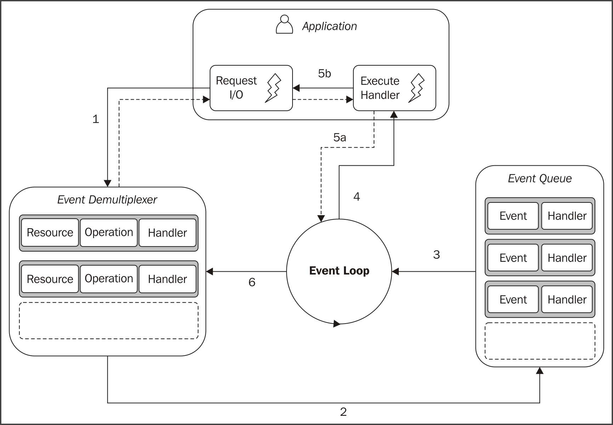

# Event loop and asynchronous tasks

There are some unique design patterns followed by the Javascript engine, which is important to be aware if you want to become a proficient Javascript developer.

## Blocking vs Non-blocking \(a.k.a Asynchronous\) Tasks

As we learnt in previous sessions, the Javascript engine only provide one thread to run the event loop. We need to understand the implication of this fact.

One of the implication is if a task takes too long to finish, all the other events in the Event Queue cannot be processed in time, then end users may feel the UI is not responsive. For example, if a user clicks a button and the event handler is triggered and put into the Event Queue, however, there is a long-running task that hogs the Call Stack, then the button-click event handler will not be run in time, and the user would wonder why the button does not work.

This kind of **blocking** behavior can be a result of CPU-intensive number-crunching task, or a result of calling some [blocking API](https://nodejs.org/en/docs/guides/blocking-vs-non-blocking/). One typical blocking task is call synchronous I/O tasks, which happens when your application needs to read a file from hard disk \(or make an HTTP request\) and it waits for the result to be ready before it moves to the next step.

```javascript
const data = fs.readFileSync(...)
console.log(data);
```

Writing code in this kind of **synchronous** style is very common \(you have already written some code like this in the past!\), but if your code needs to be executed by Javascript engine, it's generally a bad behavior and we should avoid it. Most of the time, the tasks in the event queue should be finished quickly, and if a task needs to take sometime \(e.g. reading a file from hard disk\), the task should be executed **asynchronously**.

What does it mean by running a task asynchronously? What's the benefit of running tasks in this way? Let's look at one example:

> Analogy: Ordering food at a restaurant. You go to your favorite fast food restaurant and you get in line. Once it’s your turn, your waiter takes your order. Your waiter delegates the order to the kitchen and gives you a waiting number, so that they can serve you later when your burger is ready. This is an extremely efficient model because the waiter can quickly process many orders from different customers. Compare this with another approach, whereas the waiter takes your order, wait for it to be prepared while other customers wait in line, and finally move to the next person in line once your burger is ready. Most of the time, the waiter is just waiting and doing nothing, while he/she could have served the next person in line.

This asynchronous execution process can be illustrated with the picture below:



\(credit: the image is taken from the book [Node Design Patterns](https://www.packtpub.com/web-development/nodejs-design-patterns-second-edition)\)

Note that there is a new component we introduced in the picture called "**Event Demultiplexer**". This is a component to hold the asynchronous tasks while the underlying operating system is working on the request. For example, if the task is to read a file from hard disk, the task would call an operating system API to read the file, and then be parked with the "**Event Demultiplexer**" until operating system notifies Javascript engine that the file is ready to be consumed. Note that there is an **Handler** associated with each task, which will be called by the Javascript engine to handle the event.

Let's go through the steps:

1. The application generates a new I/O operation by submitting a request to the **Event Demultiplexer**. The application also specifies a **handler**, which will be invoked when the operation completes. Submitting a new request to the Event Demultiplexer is a **non-blocking call** and it immediately returns control to the application.
2. When a set of I/O operations completes, the **Event Demultiplexer** receives notification from the operating system and pushes the new events into the **Event Queue**.
3. At this point, the **Event Loop** iterates over the items of the **Event Queue**.
4. For each event, the associated **handler** is invoked.
5. The handler, which is part of the application code, will give back control to the **Event Loop** when its execution completes \(5a\). However, new **asynchronous operations** might be requested during the execution of the handler \(5b\), causing new operations to be inserted in the **Event Demultiplexer** \(this is step 1\), before control is given back to the **Event Loop**.
6. When all the items in the **Event Queue** are processed, the loop will block again on the **Event Demultiplexer** which will then trigger another cycle when a new event is available.

Now we understand the importance of asynchronous tasks, how can we write code to make them asynchronous? Javascript provides a few tools for this purpose and we will cover them in the following sections:

* callback
* promise
* async/await

## Recommended reading

* [MDN docs on the event loop](https://developer.mozilla.org/en-US/docs/Web/JavaScript/EventLoop)
* [What is the event loop](https://hackernoon.com/understanding-js-the-event-loop-959beae3ac40)
* [What the hack is event loop anyway](https://2014.jsconf.eu/speakers/philip-roberts-what-the-heck-is-the-event-loop-anyway.html)
* [How JavaScript works: Event loop and the rise of Async programming](https://blog.sessionstack.com/how-javascript-works-event-loop-and-the-rise-of-async-programming-5-ways-to-better-coding-with-2f077c4438b5)
* [How Javascript works in browser and node](https://itnext.io/how-javascript-works-in-browser-and-node-ab7d0d09ac2f)
* [The JavaScript event loop explained](https://blog.carbonfive.com/2013/10/27/the-javascript-event-loop-explained/)
* [What you should know to really understand the Node.js Event Loop](https://medium.com/the-node-js-collection/what-you-should-know-to-really-understand-the-node-js-event-loop-and-its-metrics-c4907b19da4c)
* [The NodeJS event loop](https://flaviocopes.com/node-event-loop/)
* [Understanding Execution Context and Execution Stack in Javascript](https://blog.bitsrc.io/understanding-execution-context-and-execution-stack-in-javascript-1c9ea8642dd0)
