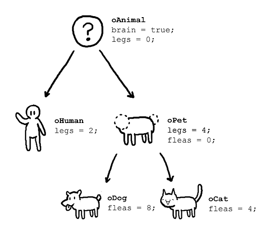

# Classes

## Learning checklist

* what does the word `class` mean?
* what are classes, and what they are used for
* how to define classes
* how to instantiate objects of a given class using the `new` keyword
* what is `this`
* how to extend a class to create a new subclass
* what does `super()` and `super.someMethod()` do
* rule of thumb for naming: use nouns for class names \(e.g. `Person`, `Student`, `Teacher`\), use verbs for function/method names \(`.walk()`, `.talk()`, etc\)

## What is a class?

Classes are blueprints for instantiating \(i.e. creating\) Javascript objects. 



## How to define a class in JavaScript

```javascript
class Person {
    constructor(name, age) {
        this.name = name;
        this.age = age;
    }
};
```

With this class defined, you can **instantiate** new objects for this class.

```javascript
var david = new Person('david', 30);
var gordon = new Person('gordon', 18);
```

### Constructor

* What is constructor\(\)
  * The `constructor()` method is a special method for creating and initializing an object created with a class. There can only be one special method with the name "constructor" in a class. A SyntaxError will be thrown if the class contains more than one occurrence of a constructor method.
  * constructors are optional
* What happens when a constructor is called
  * `constructor()` is called at the moment an object is instantiated. An empty object is created, and it's referred as `this` in the constructor. Then the fields of the object is populated according to what you set in the constructor.
  * In the end, the object is returned from the constructor (although you don't need the return statement)

### Instance Methods

You can define methods that is available in each object created from this class.

```javascript
class Person {
    constructor(name, age) {
        this.name = name;
        this.age = age;
    }

    makeIntroduction() {   // this is a method
        console.log('hi! i am', this.name);
    }
};

var gordon = new Person('gordon', 18);
gordon.makeIntroduction()
```

### Static Methods

You can also create methods that is owned by the class itself, and you can call it without creating new instances of the class.

```javascript
class Person {
    constructor(name, age) {
        this.name = name;
        this.age = age;
    }

    static isOnEarth() {
        return true;
    }
};

console.log(Person.isOnEarth());
```

### Instance Properties

If you know other programming languages (like C#, Java, etc), you are aware that you can declare instance properties in class declaration, like the example given below.

```javascript

class Person {
    address: "";

    setAddress(address) {
      this.address = address;
    }

    getAddress() {
      return this.address;
    }
};

const gordon = new Person();
gordon.setAddress("Singapore")
console.log(gordon.getAddress());

```

However, this syntax is not supported in ES6 yet. It's still a [proposal](https://tc39.github.io/proposal-class-public-fields/).

If you want to use it right now in your code, you need to use this [babel plugin](https://babeljs.io/docs/en/babel-plugin-transform-class-properties)

### Create sub-classes

* inheritance
* `super()` and `super.someMethod()` - The `super` keyword is used to call methods on an object's parent.

```javascript
class Person {
    constructor(name, age) {
        this.name = name;
        this.age = age;
    }

    makeIntroduction() {
        console.log('hi! i am', this.name);
    }

    sayAge() {
        console.log('i am', this.age, 'years old');
    }
}


class JumpStarter extends Person {
  constructor(name, age, specialSkill) {
      super(name, age)          // this calls the constructor of the super class (Person)
      this.specialSkill = specialSkill
  }

  makeIntroduction() {
    super.makeIntroduction();
    console.log('i am a JumpStarter and my special skill is ' + this.specialSkill );
  }

  writeCode() {
    console.log('writing code!');
  }
}

tom = new JumpStarter('tom', 10, 'TDD');
tom.sayAge();            // inherited method
tom.makeIntroduction();  // overriden method
tom.writeCode();         // new method
```

## Resources

* [MDN Class docs](https://developer.mozilla.org/en-US/docs/Web/JavaScript/Reference/Classes)

## Assignment

* [https://github.com/thoughtworks-jumpstart/javascript-classes](https://github.com/thoughtworks-jumpstart/javascript-classes)

