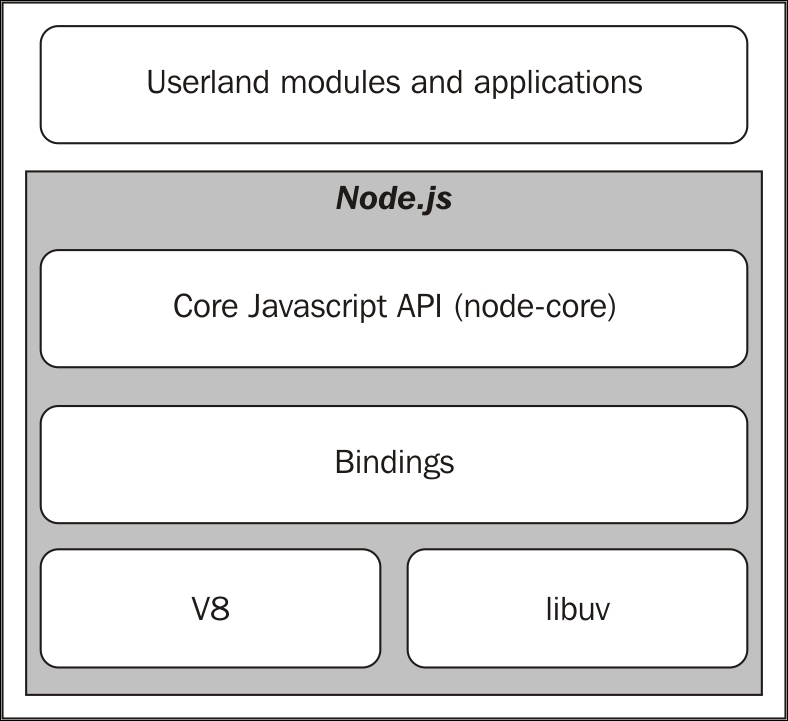

# Node and npm

## What's NodeJS

Node.js is a platform for building fast and scalable server applications using JavaScript.



* libuv: the low-level I/O engine of Node.js. it encapsulate the details of different I/O APIs on various operating systems
* V8, the JavaScript engine originally developed by Google for the Chrome browser.
* bindings, responsible for wrapping and exposing libuv and other low-level functionality to JavaScript.
* node-core, a core JavaScript library that implements the high-level Node.js API.

## History of NodeJS

* [History of NodeJS](https://blog.risingstack.com/history-of-node-js/)

## Why use NodeJS?

Many of the frontend developer tools \(e.g. webpack, gulp, etc\) are built on top of NodeJS.

For server side applications, it's a good idea to use NodeJS when you know the application is I/O bound. For example,

* Building dynamic websites
* Building a blog system
* Build a CRUD style REST API

Don't use NodeJS to build your server side application under the following cases:

* The application is CPU bound \(i.e. it needs to do heavy computation\)
* The application is memory bound \(e.g. it takes to loads several GBs of data into memory\)

## Dev Environment Setup

### Installing NodeJS on your computer

In case you haven't setup NodeJS environment on your computer yet, you can download it from [the official website](https://nodejs.org/en/download/)

For people using Mac and `homebrew`, you can [install it via Homebrew](https://shapeshed.com/setting-up-nodejs-and-npm-on-mac-osx/)

You can also try to install it via the [Node Version Manager](https://github.com/creationix/nvm). The benefit of using Node Version Manager is you can easily switch between multiple versions of node.

Tip: To test that you've got Node.js correctly installed on your computer, open a new terminal and type `node --help` and you should see the usage documentation.

## The command-line tools for NodeJS

* node
* npm

## Executing JavaScript with `node`

```bash
node app.js
```

## Package management with npm

### What is it?

[https://docs.npmjs.com/getting-started/what-is-npm](https://docs.npmjs.com/getting-started/what-is-npm)

### What do we use it for?

* Packaging our node modules into libraries and share them with others
* Reuse libraries built by other people
* Manage dependencies \(libraries and their versions\) used in a project
* Building our projects \(by providing the `scripts` in `package.json` file\)

### Important commands for npm

* Create a new project
  * `npm init`
  * This creates a `package.json` file \(our project configuration file\)
* Add a package as a runtime dependency
  * `npm install <package-name>`
* Add a package as a development dependency
  * `npm install --save-dev <package-name>`
* Install a package globally
  * `npm install -g <package-name>`
  * NOTE: This is rarely needed. Prefer local dependencies and `npx` where possible.
* Remove packages used in your project
  * `npm uninstall <package-name>`
* Install all libraries declared in the `package.json` \(or `package-lock.json`\) file
  * `npm install`

### Understanding package.json

Tools like `npm` and `yarn` need some configuration file called `package.json`.

Here is a sample `package.json`:

```javascript
{
  "name": "node-js-sample",
  "version": "0.2.0",
  "description": "A sample Node.js app",
  "main": "index.js",
  "scripts": {
    "start": "node index.js"
  },
  "dependencies": {
    "express": "^4.13.3"
  },
  "engines": {
    "node": "4.0.0"
  },
  "repository": {
    "type": "git",
    "url": "https://github.com/heroku/node-js-sample"
  },
  "keywords": [
    "node",
    "heroku",
    "express"
  ],
  "author": "Mark Pundsack",
  "contributors": [
    "Zeke Sikelianos <zeke@sikelianos.com> (http://zeke.sikelianos.com)"
  ],
  "license": "MIT"
}
```

The [official documentation](https://docs.npmjs.com/files/package.json) lists down all the fields you can put in this file.

### Understanding the version numbers in `dependencies`

In the `dependencies` section of `package.json`, you will see the list of libraries and their corresponding versions. You may notice some special characters like `~` or `^` used in the version numbers.

Those characters are used to define what happens when there are newer releases of the libraries.

More details can be found here: [Semantic Versioning](https://docs.npmjs.com/getting-started/semantic-versioning)

### Understanding the node\_modules directory

This directory is automatically created by npm command when you install libraries for your project with `npm install` command.

### Understanding `package-lock.json` file.

After you initialise your project with `npm init` and install a few packages with `npm install` command, you would notice that a new file called `package-lock.json` is automatically generated for you.

> > package-lock.json is automatically generated for any operations where npm modifies either the node\_modules tree, or package.json. It describes the exact tree that was generated, such that subsequent installs are able to generate identical trees, regardless of intermediate dependency updates.

Note:

* don't modify `package-lock.json` file manually, run `npm update` to update the dependencies
* commit `package-lock.json` file into your code repository so that everyone in your team use the same version of libraries as specified in the `package-lock.json` file \(when they run `npm install` command\)

### NPM registry

[NPM registry](https://www.npmjs.com/) is the place where JavaScript libraries can be published and downloaded.

* [How to manage a node module with npm](https://github.com/workshopper/how-to-npm)

## Lab

Let's try the npm package that we installed!

* create a file \(`main.js`\) and paste the code snippets below
* Open the terminal in VS Code: `Ctrl` + \`
* Run this file: `node main.js`

```javascript
const cows = require("cows");

cow = cows()[0]; // try different array indexes (e.g. 1, 2, 3)

console.log(cow);
```

## Resources

* [Everything You Wanted To Know About package-lock.json](https://medium.com/@Quigley_Ja/everything-you-wanted-to-know-about-package-lock-json-b81911aa8ab8)

